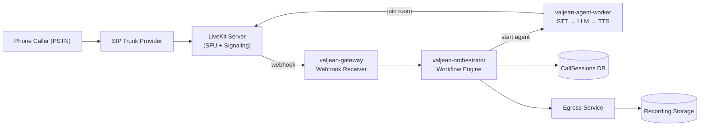
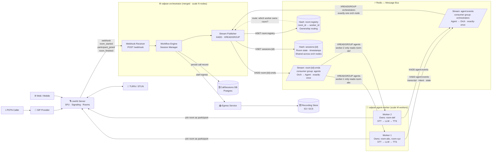
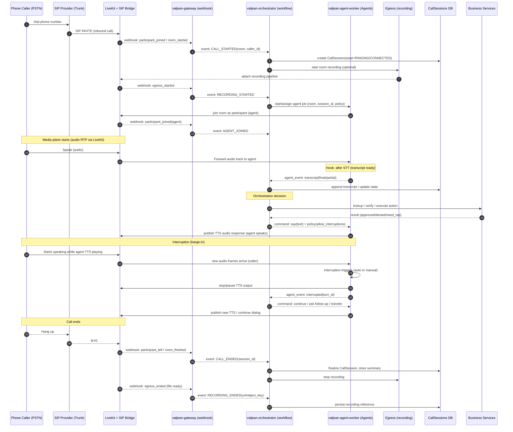
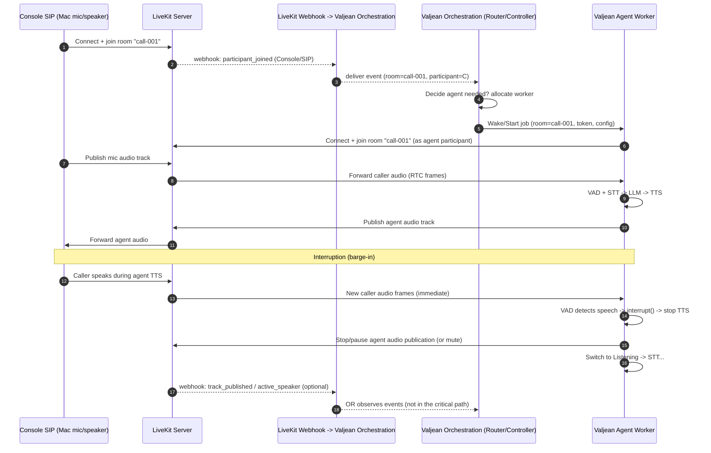

# Design

## Flow

```mermaid
flowchart LR
    PSTN["Phone Caller (PSTN)"]
    SIPPROV["SIP Trunk Provider"]
    LK["LiveKit Server\n(SFU + Signaling)"]
    GW["valjean-gateway\nWebhook Receiver"]
    OR["valjean-orchestrator\nWorkflow Engine"]
    AG["valjean-agent-worker\nSTT → LLM → TTS"]
    DB[("CallSessions DB")]
    REC[("Recording Storage")]
    EG["Egress Service"]
    PSTN --> SIPPROV
    SIPPROV --> LK
    LK -->|webhook| GW
    GW --> OR
    OR -->|start agent| AG
    AG -->|join room| LK
    OR --> DB
    OR --> EG
    EG --> REC
```

## Flow details with redis streams

```mermaid
flowchart LR

%% ── External ──
    PSTN["📞 PSTN Caller"]
    WEB["🌐 Web / Mobile"]
    SIP["🔀 SIP Provider"]
%% ── Infrastructure ──
    LK["🎙️ LiveKit Server\nSFU · Signaling · Rooms"]
    TURN["🔁 TURN / STUN"]
%% ── Merged service ──
    subgraph ORCH["⚙️ valjean-orchestrator (merged · scale N nodes)"]
        WH["Webhook Receiver\nPOST /webhook"]
        WF["Workflow Engine\nSession Manager"]
        PUB["Stream Publisher\nXADD · XREADGROUP"]
        WH --> WF --> PUB
    end

%% ── Redis ──
    subgraph REDIS["⚡ Redis — Message Bus"]
        direction TB
        S_EVT[/"Stream: agent:events\nconsumer group: orchestrators\nAgent → Orch · exactly-once"/]
        S_CMD[/"Stream: room:{id}:cmds\nconsumer group: agents\nOrch → Agent · exactly-once"/]
        H_REG[("Hash: room:registry\nroom_id → worker_id\nOwnership routing")]
        H_SESS[("Hash: sessions:{id}\nRoom state · timestamps\nShared across orch nodes")]
    end

%% ── Agent workers ──
    subgraph AGENTS["🤖 valjean-agent-worker (scale M workers)"]
        AG1["Worker 1\nOwns: room-abc, room-xyz\nSTT → LLM → TTS"]
        AG2["Worker 2\nOwns: room-def\nSTT → LLM → TTS"]
    end

%% ── Storage ──
    DB[("🗄️ CallSessions DB\nPostgres")]
    REC[("🎞️ Recording Store\nS3 / GCS")]
    EG["📤 Egress Service"]
%% ── Call ingress ──
    PSTN --> SIP --> LK
    WEB --> LK
    LK <--> TURN
%% ── Webhook into orchestrator ──
    LK -->|" webhook\nroom_started\nparticipant_joined\nroom_finished "| WH
%% ── Orch → Redis ──
    PUB -->|" XADD room:{id}:cmds "| S_CMD
    PUB -->|" HSET room:registry "| H_REG
    PUB -->|" HSET sessions:{id} "| H_SESS
    WF -->|persist call record| DB
%% ── Agent → Redis ──
    AG1 -->|" XADD agent:events\ntranscript · intent · state "| S_EVT
    AG2 -->|" XADD agent:events "| S_EVT
%% ── Redis → Orch (exactly one node) ──
    S_EVT -->|" XREADGROUP orchestrators\nexactly one orch node "| PUB
%% ── Redis → Agent (owning worker only) ──
    S_CMD -->|" XREADGROUP agents\nworker-1 only reads room-abc "| AG1
    S_CMD -->|" XREADGROUP agents\nworker-2 only reads room-def "| AG2
%% ── Agent joins LiveKit ──
    AG1 -->|" join room as participant "| LK
    AG2 -->|" join room as participant "| LK
%% ── Egress / recording ──
    WF -->|" start egress "| EG
    EG --> REC
%% ── Registry lookup ──
    H_REG -.->|" route: which worker owns room? "| PUB

```
## Sequence

``` mermaid
sequenceDiagram
  autonumber
  participant Caller as Phone Caller (PSTN)
  participant SIP as SIP Provider (Trunk)
  participant LK as LiveKit + SIP Bridge
  participant GW as valjean-gateway (webhook)
  participant OR as valjean-orchestrator (workflow)
  participant AG as valjean-agent-worker (Agents)
  participant EG as Egress (recording)
  participant DB as CallSessions DB
  participant PAY as Business Services

  Caller->>SIP: Dial phone number
  SIP->>LK: SIP INVITE (inbound call)
  LK-->>GW: webhook: participant_joined / room_started
  GW-->>OR: event: CALL_STARTED(room, caller_id)
  OR->>DB: create CallSession(state=RINGING/CONNECTED)

  OR->>EG: start room recording (optional)
  EG-->>LK: attach recording pipeline
  LK-->>GW: webhook: egress_started
  GW-->>OR: event: RECORDING_STARTED

  OR->>AG: start/assign agent job (room, session_id, policy)
  AG->>LK: join room as participant (agent)
  LK-->>GW: webhook: participant_joined(agent)
  GW-->>OR: event: AGENT_JOINED

  Note over Caller,LK: Media plane starts (audio RTP via LiveKit)
  Caller->>LK: Speak (audio)
  LK->>AG: Forward audio track to agent

  Note over AG: Hook: after STT (transcript ready)
  AG-->>OR: agent_event: transcript(final/partial)
  OR->>DB: append transcript / update state

  Note over OR: Orchestration decision
  OR->>PAY: lookup / verify / execute action
  PAY-->>OR: result (approved/denied/need_otp)

  OR-->>AG: command: say(text) + policy(allow_interruptions)
  AG->>LK: publish TTS audio response (agent speaks)

  Note over Caller,AG: Interruption (barge-in)
  Caller->>LK: Starts speaking while agent TTS playing
  LK->>AG: new audio frames arrive (caller)
  AG->>AG: interruption triggers (auto or manual)
  AG->>LK: stop/pause TTS output
  AG-->>OR: agent_event: interrupted(turn_id)

  OR-->>AG: command: continue / ask follow-up / transfer
  AG->>LK: publish new TTS / continue dialog

  Note over Caller,LK: Call ends
  Caller-->>SIP: Hang up
  SIP-->>LK: BYE
  LK-->>GW: webhook: participant_left / room_finished
  GW-->>OR: event: CALL_ENDED(session_id)
  OR->>DB: finalize CallSession, store summary

  OR->>EG: stop recording
  LK-->>GW: webhook: egress_ended (file ready)
  GW-->>OR: event: RECORDING_ENDED(url/object_key)
  OR->>DB: persist recording reference
```

### Demo with console is SIP

```mermaid
sequenceDiagram
    autonumber
    participant C as Console SIP (Mac mic/speaker)
    participant LK as LiveKit Server
    participant WH as LiveKit Webhook -> Valjean Orchestration
    participant OR as Valjean Orchestration (Router/Controller)
    participant AG as Valjean Agent Worker

    C->>LK: Connect + join room "call-001"
    LK-->>WH: webhook: participant_joined (Console/SIP)
    WH-->>OR: deliver event (room=call-001, participant=C)

    OR->>OR: Decide agent needed? allocate worker
    OR->>AG: Wake/Start job (room=call-001, token, config)
    AG->>LK: Connect + join room "call-001" (as agent participant)

    C->>LK: Publish mic audio track
    LK->>AG: Forward caller audio (RTC frames)

    AG->>AG: VAD + STT -> LLM -> TTS
    AG->>LK: Publish agent audio track
    LK->>C: Forward agent audio

    Note over C,AG: Interruption (barge-in)
    C->>LK: Caller speaks during agent TTS
    LK->>AG: New caller audio frames (immediate)
    AG->>AG: VAD detects speech -> interrupt() -> stop TTS
    AG->>LK: Stop/pause agent audio publication (or mute)
    AG->>AG: Switch to Listening -> STT...
    LK-->>WH: webhook: track_published / active_speaker (optional)
    WH-->>OR: OR observes events (not in the critical path)
```
