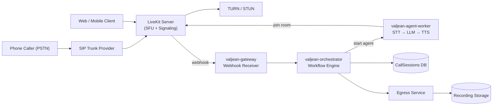
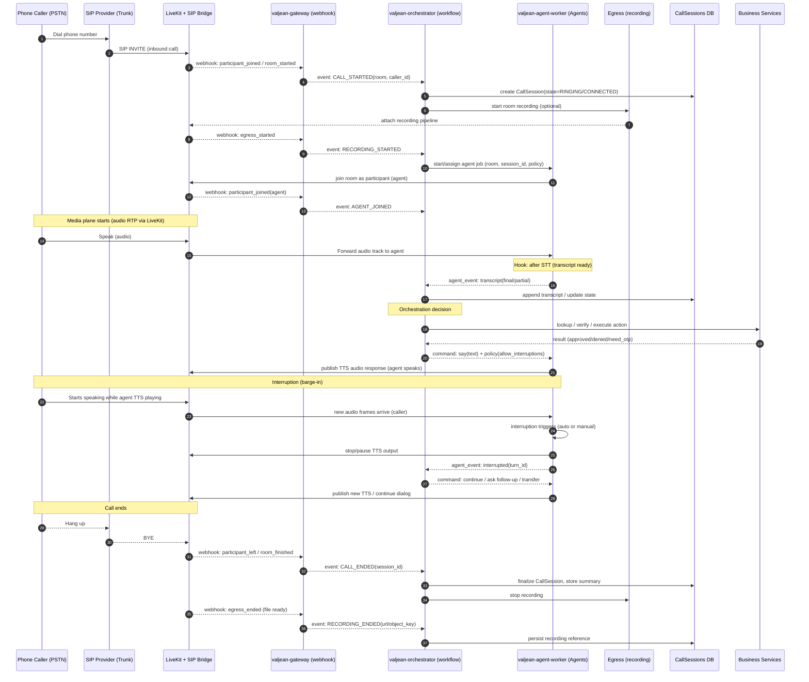

# Design

## Flow

```mermaid
flowchart LR

    PSTN["Phone Caller (PSTN)"]
    WEB["Web / Mobile Client"]
    SIPPROV["SIP Trunk Provider"]

    LK["LiveKit Server\n(SFU + Signaling)"]
    TURN["TURN / STUN"]

    GW["valjean-gateway\nWebhook Receiver"]
    OR["valjean-orchestrator\nWorkflow Engine"]
    AG["valjean-agent-worker\nSTT → LLM → TTS"]

    DB[("CallSessions DB")]
    REC[("Recording Storage")]

    EG["Egress Service"]

    PSTN --> SIPPROV
    SIPPROV --> LK
    WEB --> LK
    LK --> TURN

    LK -->|webhook| GW
    GW --> OR

    OR -->|start agent| AG
    AG -->|join room| LK

    OR --> DB
    OR --> EG
    EG --> REC
```
## Sequence

``` mermaid
sequenceDiagram
  autonumber
  participant Caller as Phone Caller (PSTN)
  participant SIP as SIP Provider (Trunk)
  participant LK as LiveKit + SIP Bridge
  participant GW as valjean-gateway (webhook)
  participant OR as valjean-orchestrator (workflow)
  participant AG as valjean-agent-worker (Agents)
  participant EG as Egress (recording)
  participant DB as CallSessions DB
  participant PAY as Business Services

  Caller->>SIP: Dial phone number
  SIP->>LK: SIP INVITE (inbound call)
  LK-->>GW: webhook: participant_joined / room_started
  GW-->>OR: event: CALL_STARTED(room, caller_id)
  OR->>DB: create CallSession(state=RINGING/CONNECTED)

  OR->>EG: start room recording (optional)
  EG-->>LK: attach recording pipeline
  LK-->>GW: webhook: egress_started
  GW-->>OR: event: RECORDING_STARTED

  OR->>AG: start/assign agent job (room, session_id, policy)
  AG->>LK: join room as participant (agent)
  LK-->>GW: webhook: participant_joined(agent)
  GW-->>OR: event: AGENT_JOINED

  Note over Caller,LK: Media plane starts (audio RTP via LiveKit)
  Caller->>LK: Speak (audio)
  LK->>AG: Forward audio track to agent

  Note over AG: Hook: after STT (transcript ready)
  AG-->>OR: agent_event: transcript(final/partial)
  OR->>DB: append transcript / update state

  Note over OR: Orchestration decision
  OR->>PAY: lookup / verify / execute action
  PAY-->>OR: result (approved/denied/need_otp)

  OR-->>AG: command: say(text) + policy(allow_interruptions)
  AG->>LK: publish TTS audio response (agent speaks)

  Note over Caller,AG: Interruption (barge-in)
  Caller->>LK: Starts speaking while agent TTS playing
  LK->>AG: new audio frames arrive (caller)
  AG->>AG: interruption triggers (auto or manual)
  AG->>LK: stop/pause TTS output
  AG-->>OR: agent_event: interrupted(turn_id)

  OR-->>AG: command: continue / ask follow-up / transfer
  AG->>LK: publish new TTS / continue dialog

  Note over Caller,LK: Call ends
  Caller-->>SIP: Hang up
  SIP-->>LK: BYE
  LK-->>GW: webhook: participant_left / room_finished
  GW-->>OR: event: CALL_ENDED(session_id)
  OR->>DB: finalize CallSession, store summary

  OR->>EG: stop recording
  LK-->>GW: webhook: egress_ended (file ready)
  GW-->>OR: event: RECORDING_ENDED(url/object_key)
  OR->>DB: persist recording reference
```
